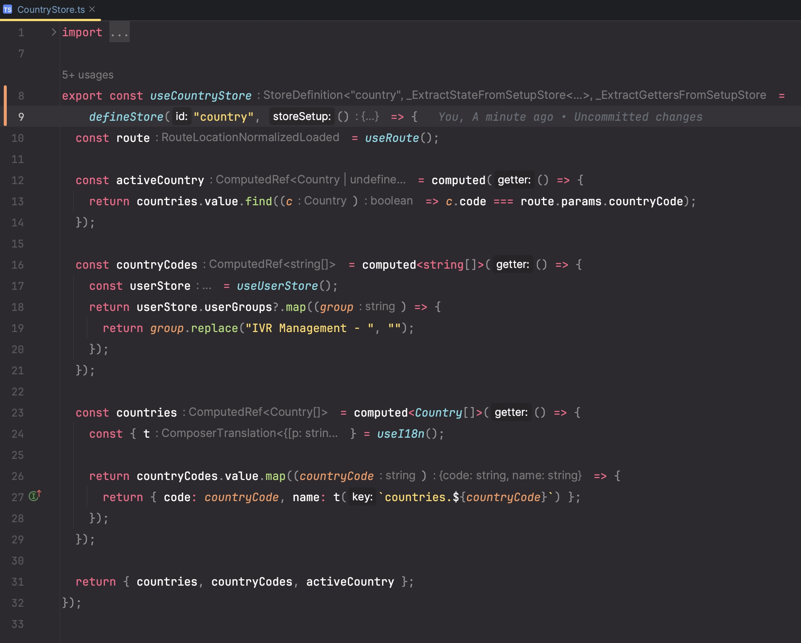
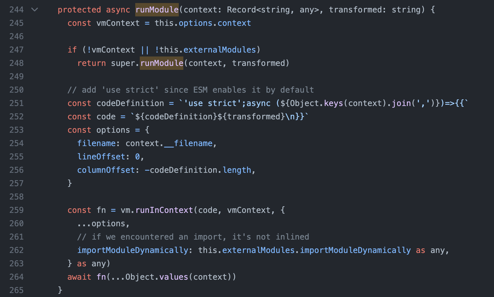

# TDD - Mocking vue-router with vitest

## Background

Our current project, both front-end and back-end, is based on TDD. For the front-end, we use vitest as the testing
framework, along with vue-test-utils as the testing tool. Tech stack: TypeScript + Vue3 + vue-router + pinia + vitest.

Last week, a colleague mentioned that she was working on a feature to read the current user's country group permissions
from
the okta userinfo API. The code implementation was complete, but when submitting the code, she found that several
existing test cases kept failing, all encountering the same problem:

> TypeError: Cannot read properties of undefined (reading 'beforeEach')

At first, we didn't know the reason and couldn't think of a good solution, so we tried introducing a third-party
library, vue-router-mock, to mock vue-router as a workaround.

I had encountered this problem before, but we always found other ways around it; this time, I thought there might be a
way to solve it without introducing a new third-party library, so I researched and tried various methods, finally fixing
the issue.

## Problem

This is a failed test case excerpted from the countrySelectorComponent spec at the time, along with the code for the
countryStore.




Running this test case resulted in an error, with the following message:


> TypeError: Cannot read properties of undefined (reading 'beforeEach')

The error originated from `router/index.ts` in the line `router.beforeEach(() => {})`.

we had already mocked `vue-router` at the beginning of this test file.

Theoretically, the code in `router/index.ts` should not have been executed.

Then, I carefully examined the error message,


It turned out that `src/main.ts` imported `router/index.ts`.


Following this train of thought, I analyzed this long dependency path.

src/tests/components/CountrySelectorComponent.spec.ts: `import CountrySelectorComponent from "
../../components/CountrySelectorComponent.vue";`

-->

src/components/CountrySelectorComponent.vue: ` import { useCountryStore } from "../stores/CountryStore";`

-->

src/stores/CountryStore.ts: `import { useUserStore } from "./UserStore.ts";`
        <div class="prose prose-lg mx-auto dark:prose-invert">
-->

src/stores/UserStore.ts: `import { i18n } from "../main";`

src/main.ts: `import router from "./router";`

-->

src/router/index.ts: `router.beforeEach(() => {})`

Analyzing the layers of dependencies, it became clear that we indeed had a dependency on `router/index.ts`.

Additionally, we could further study the error stack -

```
TypeError: Cannot read properties of undefined (reading 'beforeEach')
    at /Users/binliu.zhang/workspace/ivr-client/src/router/index.ts:49:8
    at VitestExecutor.runModule (file:///Users/binliu.zhang/workspace/ivr-client/node_modules/vite-node/dist/client.mjs:341:5)
    at VitestExecutor.directRequest (file:///Users/binliu.zhang/workspace/ivr-client/node_modules/vite-node/dist/client.mjs:325:5)
    at VitestExecutor.cachedRequest (file:///Users/binliu.zhang/workspace/ivr-client/node_modules/vite-node/dist/client.mjs:188:14)
    at VitestExecutor.dependencyRequest (file:///Users/binliu.zhang/workspace/ivr-client/node_modules/vite-node/dist/client.mjs:222:12)
```

To understand what this code
does([Vitest source code](https://github.com/vitest-dev/vitest/blob/main/packages/vitest/src/runtime/execute.ts#L244)),
I enabled debug breakpoints and found that vitest performs static
analysis on the dependencies of a test case before executing it. It runs dependencyRequest for each module dependency
and then runModule.




We can see it will load mocks first, then request the real dependencies and run them.

We called `vi.mock("vue-router")` at the very beginning of our test file. It will always be executed before all imports.
However, in `router/index.ts`, we found that router actually comes from `createRouter` --

```ts

// router/index.ts
import {createRouter, createWebHistory} from "vue-router";

const router = createRouter({
    history: createWebHistory(process.env.BASE_URL),
    routes,
});
router.beforeEach(() => {
});
```

But now `createRouter` is just a mocked empty function `() => {}`, calling it will only return `undefined`, so router is
also
`undefined`, hence the error `Cannot read properties of undefined (reading 'beforeEach')`.

## Solution

Now that we know where the problem lies, solving it becomes relatively simple. Considering we do not use the code in
`router/index.ts` in our test case, we can mock this file `router/index.ts`  in `test/setup.ts`, so that the code
in `router/index.ts` will
not be executed.

```ts
// test/setup.ts

import {vi} from "vitest";

vi.mock("../router/index.ts", () => ({
    default: {},
}));
```

After adding this code, the problem was resolved.

## Further Thoughts

After initially resolving the issue, I continued to ponder whether we could solve this problem without mocking
`router/index.ts` in `test/setup.ts`, but instead mock `createRouter` in the test case as we did before
with `useRouter` & `useRoute`. I tried the following code, but it didn't work.

```ts
// won't work

vi.mock("vue-router");
const mockRouter = {
    push: vi.fn(),
};
test("should display the right amount of list items", async () => {
    (useRoute as Mock).mockReturnValue({
        params: {countryCode: countryList[0].code},
    });
    (useRouter as Mock).mockReturnValue({});

    (createRouter as Mock).mockReturnValue(mockRouter);
});
```

Running the test case, the same error occurs

> TypeError: Cannot read properties of undefined (reading 'beforeEach')
>
>  at /Users/binliu.zhang/workspace/ivr-client/src/router/index.ts:49:8

Why is this? We know that `createRouter` is called in `router/index.ts`. As mentioned earlier, because
vitest first analyzes dependencies `VitestExecutor.dependencyRequest()` and then runs `VitestExecutor.runModule()`, this
process happens before the actual test case code runs, so this approach is not feasible.

Exploring further, if we do not mock `router/index.ts` but

instead use `importOriginal` to mock createRouter at the top of the test file, it works.

```ts
// works, but not recommended
// test spec file
const mockRouter = {
    push: vi.fn(),
};
vi.mock("vue-router", async (importOriginal) => {
    const mod = await importOriginal<typeof import("vue-router")>();
    return {
        ...mod,
        // replace some exports
        createRouter: () => ({
            push: vi.fn(),
            beforeEach: vi.fn(),
        }),
        useRoute: () => ({
            params: {countryCode: countryList[0].code},
        }),
        useRouter: () => mockRouter, // NOTE: must return a reference to the same object, otherwise `spyOn` won't work
    };
});

test("should display the right amount of list items", async () => {
    // ...
});

```

However, in a single file, for each test case, `useRouter` & `useRoute` always return the same mock values, which is not
very flexible as it cannot
dynamically assign values based on different test cases.

In conclusion, we chose to mock `router/index.ts` in `test/setup.ts`, so for each test case, we can mock the return
values
of `useRouter` & `useRoute` as needed.

```ts
// test/setup.ts
vi.mock("../router/index.ts", () => ({
    default: {},
}));

```
